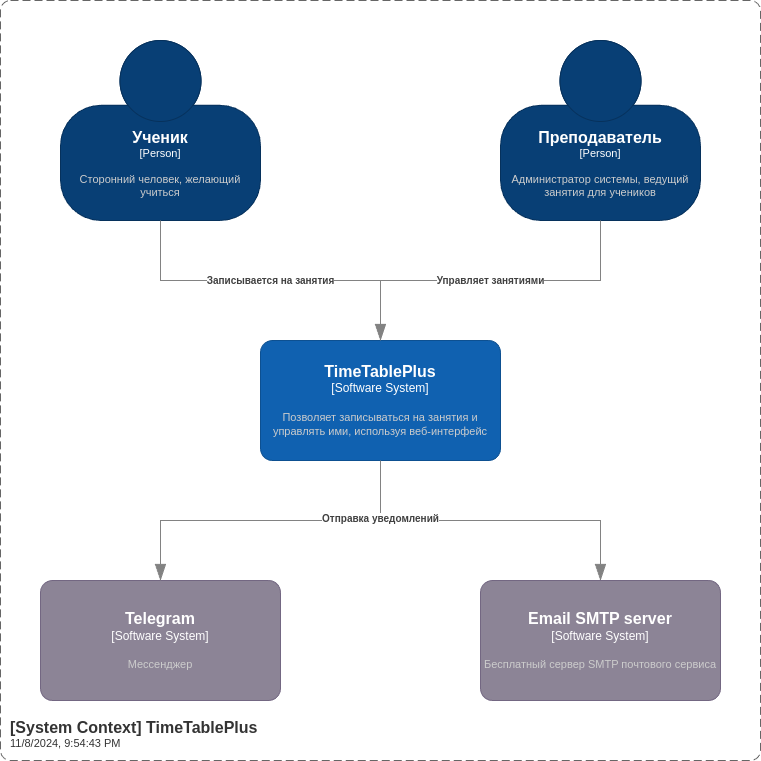
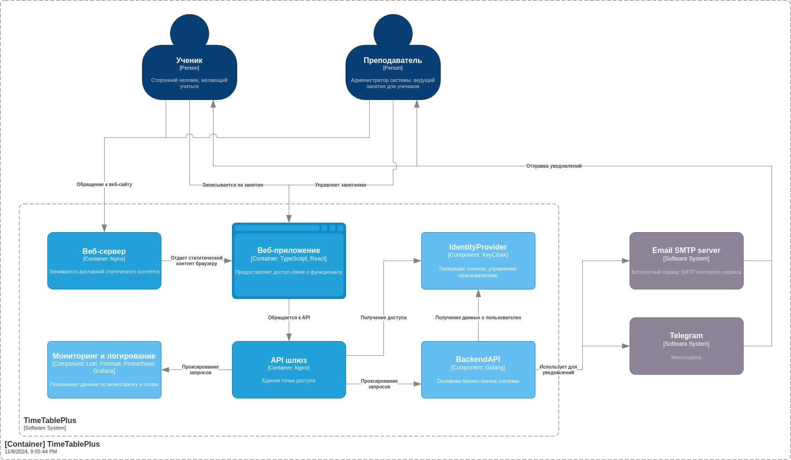
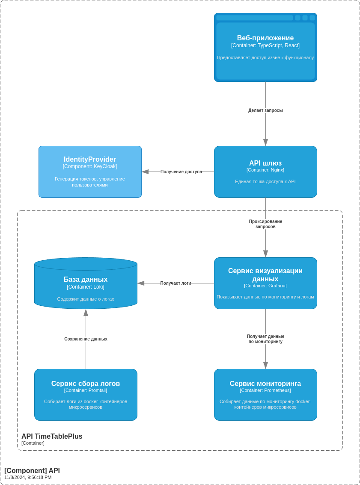
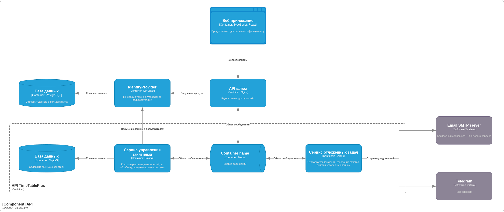

# Цель проекта
Цель проекта - разработать систему управления записями на частные занятия.
# Описание системы
Система состоит из следующих функциональных блоков:
1. Аутентификация и авторизация
2. Функционал записи на занятия
3. Дополнительный функционал для преподавателя
4. Дополнительный функционал для ученика
5. Функционал уведомлений
6. Функционал генерации отчетов
7. Функционал отложенных задач
### Регистрация
Для регистрации пользователь должен ввести свои имя и фамилию, логин и пароль. Имя и фамилия указываются с использованием сервиса [DaData](https://dadata.ru). При вводе пароля проверяется его базовая безопасность (сила пароля). В процессе регистрации пользователь может указать способ уведомления о занятиях (почта или Telegram), времени ежедневного уведомления. При указании почты она проверяется на валидность [внешним сервисом](https://verifier.meetchopra.com). При нажатии на галочку "Отказаться от уведомлений" должно показываться окно, поясняющее последствия этого отказа (отсутствие уведомлений о подтверждении занятий, отсутствие возможности смены пароля). Пользователь также может выбрать цель своего обучения, которые заранее предпопределены преподавателем.
После заполнения вышеуказанной информации пользователь нажимает кнопку "Зарегистрироваться", после чего получает всплывающее окно о том, что его аккаунт создан, и автоматически входит в сеть. Также на указанной способ уведомления отправляется сообщение об успешной регистрации. С этого момента аккаунт пользователя будет являться **учеником**.
Аккаунт преподавателя, если отсутсвует в базе данных, генерируется случайно при старте приложения. Логин и пароль от аккаунта выводятся в консоль, но в будущем могут быть изменены. Таким образом, **регистрация преподавателя в системе не предусмотрена**.
### Аутентификация и восстановление аккаунта
Для входа в аккаунт необходимо ввести логин и пароль. После ввода сервер проверяет их достоверность. Если данные не верны, показывается всплывающее окно с уведомлением об этом. Если логин был найден, а пароль неверный, то также показывается окно о неверных данных, не конкретизируя, какие именно даннные не верны. Если все данные верны, то проверяется, является ли пользователь активным - если нет, то становится таковым при входе. При входе также **обновляется время последнего входа в сеть пользователя**.
Есть возможность сменить пароль, выбрав пункт "Забыли пароль?". При использовании этой функции пользователь должен или ввести логин, или адрес электронной почты или свой Telegram. После этого отправляется ссылка для восстановления на указанный раннее способ уведомления и у соответствующего пользователя отзываются токены аутентификации. Если уведомления были отключены, то ничего со стороны сервера не происходит. В любом случае пользователю показывается всплывающее окно об том, что ему была отправлена ссылка для восстановления пароля на указанные данные. После перехода по ссылке ему предлагается ввести новый пароль **дважды**, и пользователь после ввода входит в сеть.
### Функционал записи на занятия
На стартовой странице отображено свободное время преподавателя. Оно представляет из себя **календарь**, в ячейках которого отображены временные промежутки, доступные для записи.
Выбирая промежуток, ученик может записаться на занятие и оставить какой-то комментарий к своей заявке. После этого промежуток в календаре для всех **выделяется отдельным цветом**, становится объектом "Занятие", записывается в базу данных и переходит в статус "Ожидает подтверждения преподавателя". 
Преподаватель, подтверждая занятие, определяет стоимость занятия, количество человек, может менять комментарий и время занятия.
После подтверждения преподавателя прожуток времени перестает быть виден для всех, кроме преподавателя и ученика. Занятие при этом выделяется отдельным цветом и при наведении на промежуток становится видна информация - **краткое описание и кнопка "Показать ученика", которая показывает имя и фамилию записавшегося**. Если Занятие не было подтверждено до наступления срока занятия или отклонено, оно удаляется из базы данных.
Преподаватель сам **создавать занятия для незарегистрированных учеников**. В таком случае при записи на занятие генерируется пользователь с введенными именем и фамилией, а также логином, сгенерированным на их основе, и паролем, генерируемым абсолютно случайно.
### Дополнительный функционал для преподавателя
- Может администрировать всю систему - управлять данными об учениках, занятиях.
- Может менять статус ученика в "неактивный" (в том числе массово).
- Может определять доступные цели для занятия.
- Может определять доступные временные промежутки по умолчанию для разных дней недели. Может определять недоступные для записи промежутки и дни, которые будут иметь больший приоритет над промежутками по умолчанию.
- Может рассылать уведомления для всех.
### Дополнительный функционал для ученика
- Может изменять информацию о себе: фамилию, имя, логин, пароль, цель занятий.
- Может менять способ уведомлений (почта, Telegram) или отключить их.
- Может деактивировать свой аккаунт, отключая получение массовых уведомлений.
### Функционал уведомлений
Предполагается наличие двух взаимоисключающих способов уведомлений: по почте и с помощью Telegram-бота. Отправка уведомлений по почте осуществляется с помощью сервиса [Mailgun](https://www.mailgun.com/). Отправка уведомлений с помощью Telegram-бота осуществляется с помощью вызова API из кода.
Уведомления бывают нескольких типов:
- о занятии - рассылаются при взаимодействиях с занятием;
- смена пароля;
- ежедневные - время устанавливается пользователем, содержат информацию о предстоящих занятиях сегодня;
- об очистке - отправляются преподавателю в случае удаления каких-то данных в автоматическом режиме;
- массовые - отправляются преподавателем всем активным ученикам;
- отчетность - отправляются преподавателю ежемесячно.
### Функционал генерации отчетов
В первый день месяца запускается отложенная задача о генерации отчета о занятиях по предыдущему месяцу. Отчет должен быть в двух вариантах (форматах csv и pdf) и содержать данные:
- количество зарегистрированных учеников, которые записывались на занятия в этом месяце;
- количество отработанных часов;
- общая стоимость занятий;
- информация по каждому занятию: дата и время, кто записывался, сколько учеников, цена.
Также возможна генерация отчета об удаленных неактивных учениках - в таком случае отчет должен содержать:
- информацию по удаленному пользователю;
- количество отработанных часов;
- общая стоимость занятий;
- информация по каждому занятию: дата и время, сколько учеников, цена.
### Функционал отложенных задач
#### Проверка активности пользователей
Запускается на второй день месяца, следующего за проверяемым. Если пользователь не был в сети 2 и более месяцев, то его аккаунт переводится в статус "неактивный". Если пользователь был неактивным 3 и более месяцев, то формируется отчет по всем его занятиям и отправляется преподавателю, а сам пользователь и его занятия удаляются из базы данных.
#### Очистка недоступных временных промежутков
Запускается на второй день месяца, следующего за проверяемым. Удаляет все временные промежутки, сохраненные как "недоступные для занятия" и отправляет уведомление об их очистке преподавателю.
#### Создание бэкапов
Запускается на третий день месяца, следующего за проверяемым. Архивирует базы данных пользователей и занятий и пересылает преподавателю.
#### Очистка логов и мониторинга
Запускается на 14 день месяца, следующего за проверяемым. Удаляет все данных о логах и мониторинге за прошлый месяц.
# Схема системы

Система будет состоять из отдельных микросервисов. Для общения между ними используется Redis в качестве брокера сообщений и протокол gRPC.

# Стек технологий
1. Golang (бэкенд)
2. TypeScript + React (фронтенд)
3. Nginx (веб-сервер)
4. Sqlite3 (хранение данных)
5. Redis (очереди)
6. Docker (контейнеризация)
7. Grafana (отображение информации по мониторингу и логированию)
8. Loki (хранение логов)
9. Promtail (сбор логов)
10. Prometheus (сбор и хранение мониторинговых данных)
# Интеграции
1. [GitHub Actions](https://github.com/features/actions) - для CI/CD
3. [Yandex.Metrika](https://metrica.yandex.com) - для сбора метрик по использованию системы